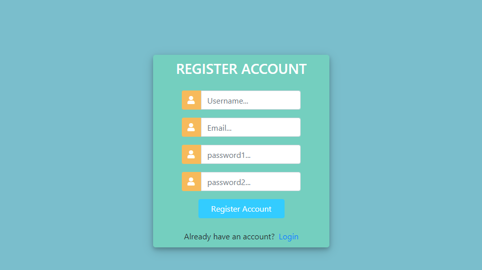
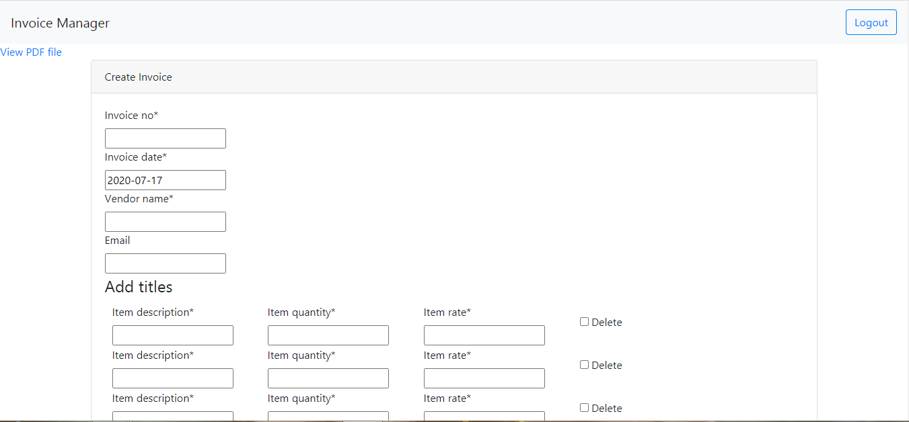
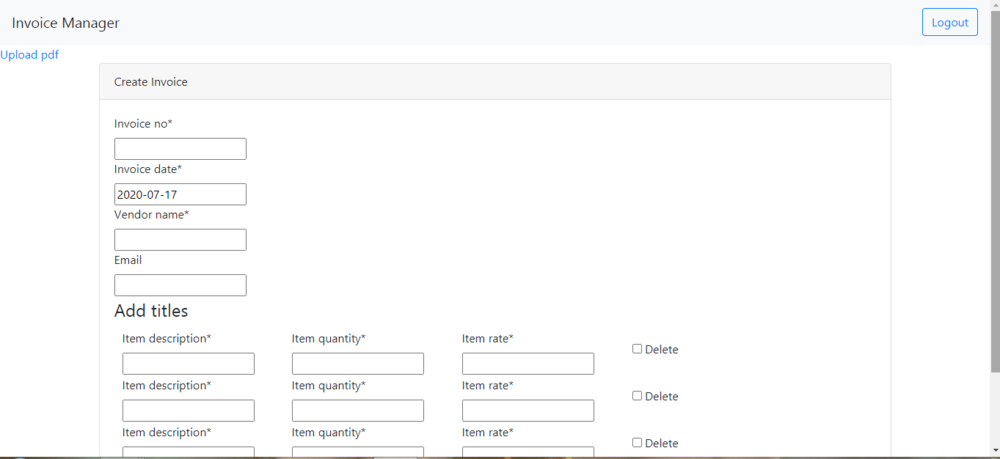
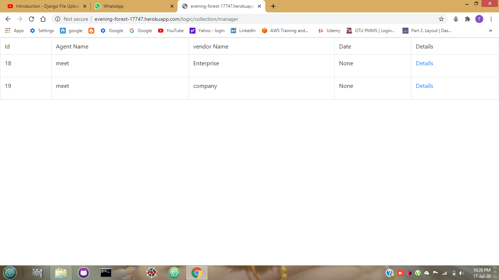
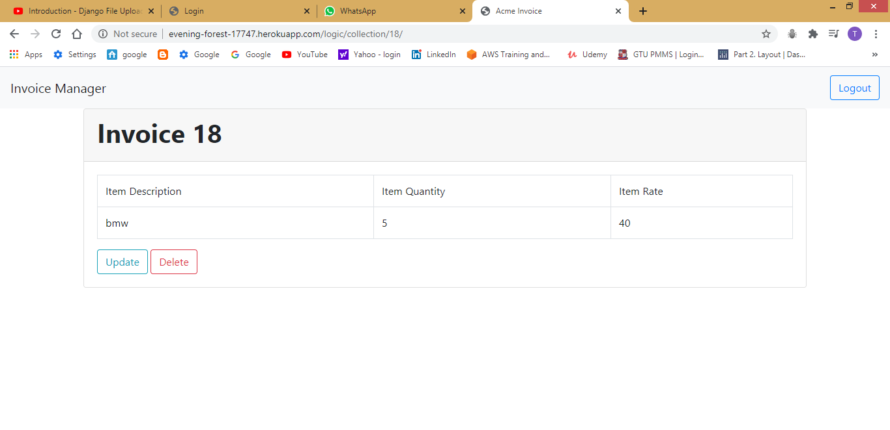

# Project Title
Invoice System in Django 

## Heroku Link
http://evening-forest-17747.herokuapp.com/

# Description
This project is made to fulfill the expected features and functions of each fields
## Features 
This application has the following features
- User Login/Registration 
- Adding  Invoices by User (Agent)
- Manager's collections
- update, delete operations for manager only

### Prerequisites for local host

Simply run django-app in conventional method.

First

```
pip install -r requirements.txt

```
then

```
python manage.py runserver

```

This is workflow of system.


The registration page.


The Login page.


Click Upload Pdf to upload file


Upload Pdf File


View Pdf in next Page


Add Agent Invoice 


Manager Collections of all Agent(user) invoices


Manager Can Update and Delete Agent invoices


## Answers to the assigment questions:

1) Minimum CPU/Memory/Storage requirements.

```
CPU: cpu requirement will be least as this app is simple and in a sense,primitive,as no heavy lifting is going on.

Memory: This app will require memory for storing the pdf files. Locally it is hosted on directory,on heroku_cloud,it can be stored on its hosted storage

```

2) Potential Security Threats.

```
No one can access the application without user login/registered 
Every Path is secured with login user_id, without user_id it will not going to allow access

For Manager can access application via link which will be send to the email address and can login with Super user user_name and password in login page
And only manager can update and delete the transactions in collections 
super user(user_name:meet,password:meet)

```

3) How many agents can handle system at a time.

```
If we are using the conventional cloud hosted system without a load balancer and scaling system,
the app might be slow as it is intensive CRUD oriented.

Thus,every person can access the system and work with it easily.

```
## Built With

* Django
* SQLite3(inbuilt with django)


## Contributing

Meet Trivedi
